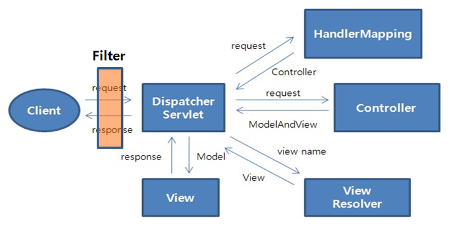

# study-Spring

- 스프링 프레임워크
    - 예전 프레임워크는 다양한 경우를 처리할 수 있는 다양한 기능을 기지도록 만들다보니,
	하나의 기능을 위해서 너무 많은 구조가 필요했다.
	기술이 너무나 복잡하고 방대했기 때문에, 전체를 이해하고 개발하기에는 어려움이 많았다.
	그래서 스프링 프레임워크가 등장했고, 특정 기능을 위주로 간단한 JAR파일 등을 이용해서
	모든 개발이 가능하도록 구성되어 있다.
 

- 스프링 프레임워크의 장점
    - 복잡함에 반기를 들어서 만들어진 프레임워크(경량화)
    - 프로젝트 전체 구조를 설계할 때 유용한 프레임워크(서버 제작의 빠른 속도)
    - 다른 프레임워크들의 포용, 여러 프레임워크를 혼용해서 사용 가능하며 이를 접착성이라고 한다.
    - 개발 생산성과 개발도구의 지원
 

- 스프링 프레임워크의 특징
    - POJO 기반의 구성
    - DI를 통한 객체간의 관계 구성
    - AOP 지원
    - 트랜잭션 관리
    - 편리한 MVC 구조
    - WAS에 종속적이지 않은 개발 환경
 

- 스프링 부트
    - 스프링 프레임워크를 사용함에 있어서 초기 설정 및 필요한 라이브러리에 대한 설정의 어려움이 많으며,
	시간이 너무 많이 걸리기 때문에 자동 설정(AutoConfiguration)과 개발에 필요한 모든 것을 관리해주는
	스프링 부트를 선호한다. 각 코어 및 라이브러리의 버전들도 맞추어야 하지만 스프링 부트를 사용하면
	이러한 복잡성을 해결하기에도 좋다.

---------------------------------------------------------------

- POJO(Plain Old Java Object) 기반의 구성
    - 오래된 방식의 간단한 자바 객체라는 의미이며, JAVA 코드에서 일반적으로
	객체를 구성하는 방식을 스프링 프레임워크에서 그대로 사용할 수 있다는 말이다.
 

- 의존성 주입(DI)을 통한 객체간의 관계 구성
    - 의존성(Dependency)이란 하나의 객체가 다른 객체 없이 제대로 된 역할을 할 수 없다는 것을 의미한다.
	예를 들어 A객체가 B객체 없이 동작이 불가능한 상황을 'A가 B에 의존적이다'라고 표현한다.

    - 주입(Injecion)은 말 그대로 외부에서 밀어 넣는 것을 의미한다.
	예를 들어 어떤 객체가 필요로하는 객체를 외부에서 밀어 넣는 것을 의미한다.
	주입을 받는 입장에서는 어떤 객체인지 신경 쓸 필요가 없고 어떤 객체에 의존하든 자신의 역할은 변하지 않는다.
 

- AOP의 지원
    - 스프링 프레임워크는 횡단 관심사를 분리해서 제작하는 것이 가능하고, 횡단 관심사를 모듈로 분리하는
	프로그래밍을 AOP라고 한다. 핵심 비지니스 로직에만 집중하여 코드 개발이 가능해지고,
	각 프로젝트마다 다른 관심사 적용 시 코드 수정을 최소화할 수 있으며,
	원하는 관심사의 유지보수가 수월한 코드로 구성이 가능해진다.
 

- 트랜잭션의 지원
    - DB 작업 시 트랜잭션을 매번 상황에 맞게 코드로 작성하지 않고, 어노테이션이나 XML로
	트랜잭션을 쉽게 관리할 수 있다.
 

- 단위 테스트
    - 전체 Application을 실행하지 않아도 기능별 단위 테스트가 용이하기 때문에
	버그를 줄이고 개발 시간을 단축할 수 있다.
  
---------------------------------------------------------------

- Spring MVC(Front-Controller 패턴)

- Spring MVC 패턴의 특징
   - HttpServletRequest, HttpServletResponse를 거의 사용할 필요 없이 기능 구현
   - 다양한 타입의 파라미터 처리, 다양한 타입의 리턴 타입 사용 가능
   - GET 방식, POST 방식 등 전송 방식에 대한 처리를 어노테이션으로 처리 가능
   - 상속/인터페이스 방식 대신 어노테이션으로만 설정 가능
   
-------------------------------------------------------------------------------------------------

- 3-tier 모듈화	
   - Presentation Tier - 화면 계층
		- 화면에 보여주는 기술을 사용하는 영역.
		- 컨트롤러에서 사용자의 요청에 맞는 응답처리를 진행하며,
		HTML엔진(Thymeleaf), HTML등이 담당하는 영역이다.
		화면 구성이 이에 속한다.

   - Business Tier - 비지니스 계층
		- 순수한 비지니스 로직을 담고 있는 영역.
		- 고객이 원하는 요구사항을 반영하는 계층이기 때문에 서비스에 있어서 가장 중요한 영역이다.
		이 영역의 설계는 고객의 요구 사항과 정확히 일치해야 하며, 서비스 영역이다.	

   - Persistence Tier - 영속 계층 혹은 데이터 계층
		- 데이터를 어떤 방식으로 보관하고, 사용하는 가에 대한 설계가 들어가는 계층.
		- 일반적으로 DBMS를 많이 이용하지만, 상황에 따라서 네트워크 호출 혹은 원격 호출 등의 기술이 접목될 수 있다.
 

   - 각 영역은 독립적으로 설계도어 나중에 특정한 기술이 변하더라도 필요한 부분을 전자제품의 부품처럼
쉽게 교환할 수 있게 하자는 방식이다. 각 연결 부위는 인터페이스를 이용해서 설계하는 것이 일반적인 구성 방식이다.

